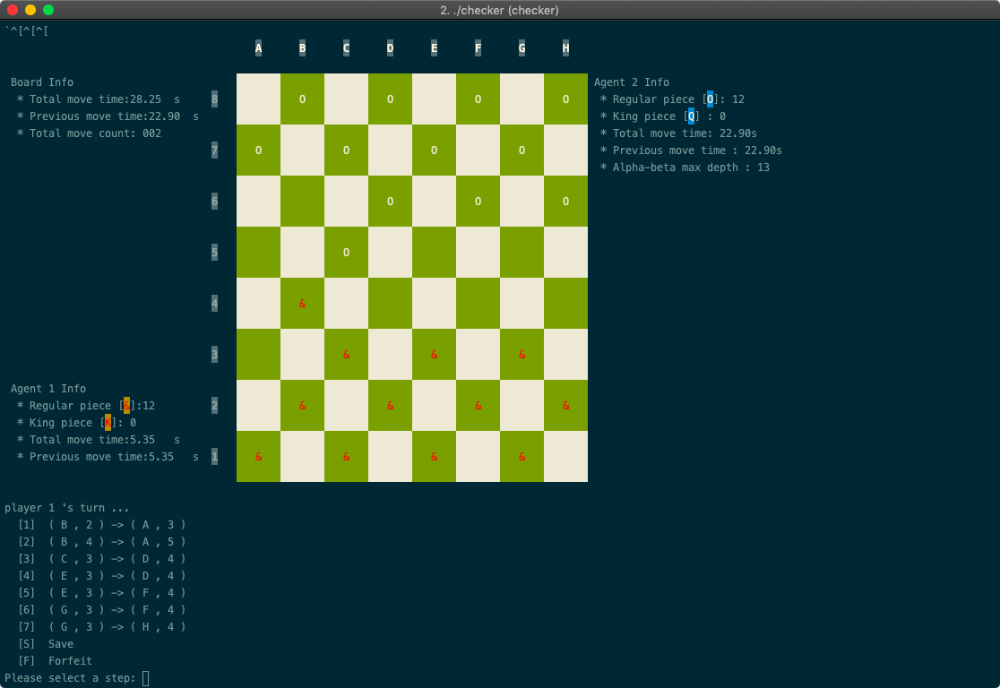
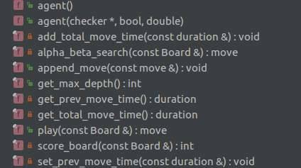
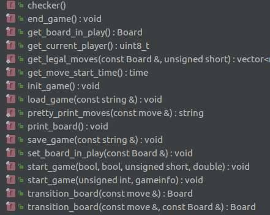

# AI Checker 
 
#### Author : Zhekai Jin (Scott)

##Description
  A checker program with the option of a pc player or a human player on both ends. The pc player use the iterative deepening & minimax alpha-beta search on the whole legal moves on the board and try to pick the best move against the other player.
  
## Screenshot  


## Dependency 
* CMAKE 3.0
* MAKE


## Usage
```
./checker
Follow the Prompt
```	
## Build
```
cd submission/
mkdir build && cd build
cmake .. && make 
./checker
```	

## Clear Build
```
cd submission/
rm -rf build
```	

## Structure 
### Agent class
* 

### Checker class
* 

## Heuristic Ideas Applied 

### Clear Difference
1. if the board has no piece left for one, set his score to be minimum and his opponent score to be maximum.
2. if the board has no legal left for one, set his score to be minimum and his opponent score to be maximum.

### Zero Sum score
0. Each player will have a postive base score of 300.
1. King is worth 1.6 and the Normal one worth 1 relatively. [1000 vs 1600]
2. Deduct point if I am not in the middle of the board.
3. Add point if I am closer to the enemy peice and I have my square behind me filled with my own piece.
4. Non-king peive will be awarded to stay in back rank and given incentive to move forward.
